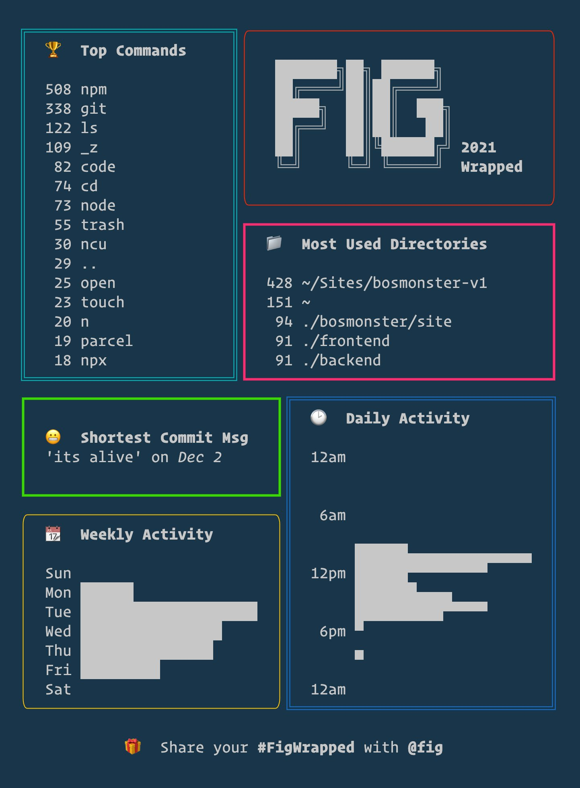
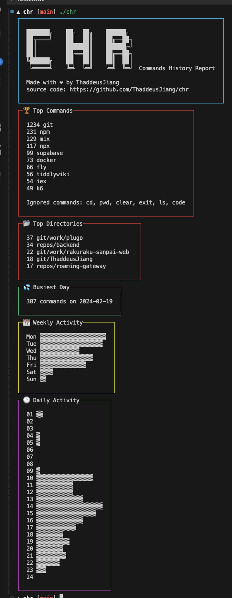

# CHR

CHR(Command History Report): A command history report tool base on your shell history file.

[](https://hex.pm/packages/chr)
[](https://twitter.com/ThaddeusJiang)

> Inspired by the Fig report, this tool aims to provide a similar experience for those not using Fig.



## Features

> [!IMPORTANT]
> CHR does not collect any data. It only processes the data in your shell history file.

- 🏆Top Commands
- 📂Top Directories
- 💦Busiest Day
- 📅Weekly Activity
- 🕙Daily Activity

## Install

requires Elixir to be installed

```sh
brew install elixir
mix escript.install hex chr
```

## Usage

```
chr
```



## Author

👤 **Thaddeus Jiang**

- Website: https://thaddeusjiang.com/
- Twitter: [@ThaddeusJiang](https://twitter.com/ThaddeusJiang)
- Github: [@ThaddeusJiang](https://github.com/ThaddeusJiang)

## Acknowledgement

This has been possible due to the previous work of numerous people. In particular:

- @borkdude - Author of babashka, thanks for helping me remove the manual data preparation requirement
